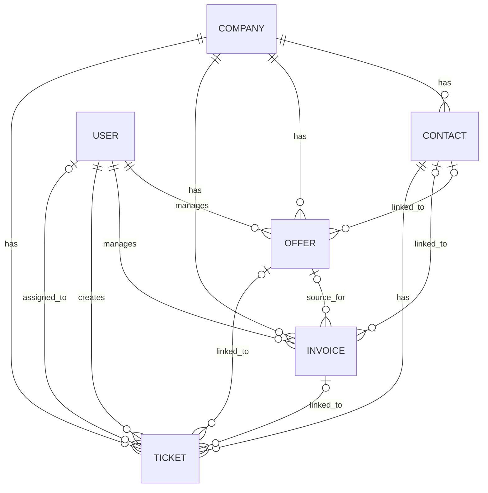
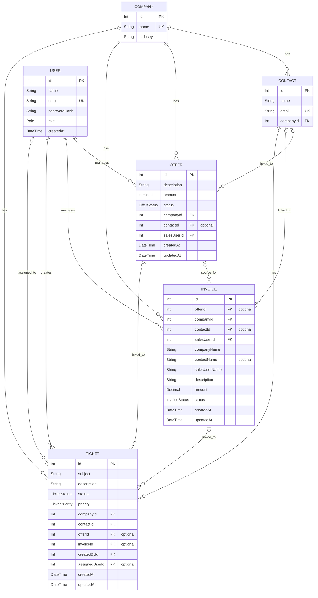
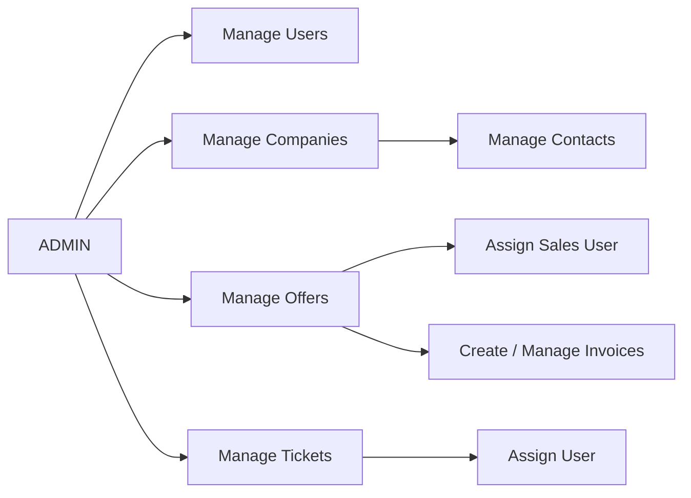
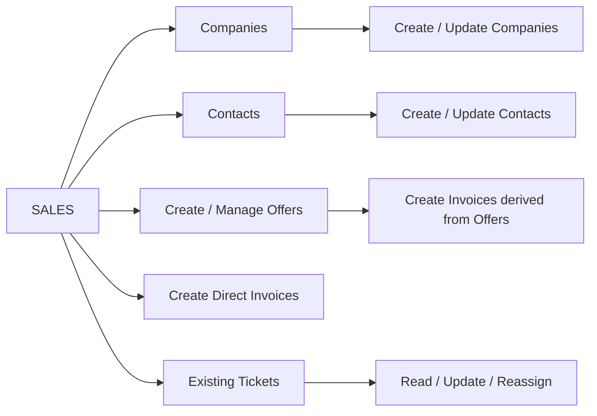
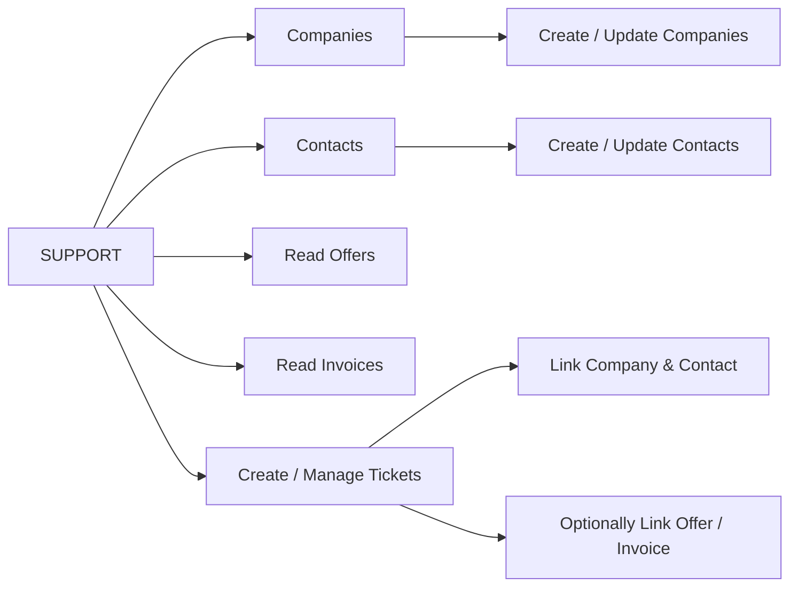

# CRM Backend API

## 1. About the Project

The CRM Backend API is a REST API for a small Customer Relationship Management system. It is designed to manage customer relationships and common business processes in one backend application.

The API allows users to manage companies and contacts, create offers and invoices, and handle support tickets. It also includes user management with role-based permissions for administrators, sales users, and support users.

### Main Features

- Company and contact management
- Offer and invoice management
- Support ticket management
- User management with role-based access
- JWT-based authentication
- Filtering and pagination for supported resources
- Input validation and centralized error handling

## 2. Tech Stack

- **Node.js** — JavaScript runtime used to build the backend application.
- **Express.js** — Web framework used to create the REST API, routes, and middleware.
- **PostgreSQL** — Relational database used for persistent storage and related CRM data.
- **Prisma ORM** — Used to define the data model, manage migrations, and interact with PostgreSQL.
- **Zod** — Used to validate request data before it reaches the database.
- **JSON Web Tokens (JWT)** — Used for stateless authentication of protected routes.
- **bcrypt** — Used to securely hash user passwords.
- **CORS** — Used to control which frontend origins can access the API.
- **express-rate-limit** — Used to limit repeated requests and protect sensitive endpoints.
- **Jest & Supertest** — Used for automated API and integration testing.

## 3. Data Model / ERD

The CRM uses a relational PostgreSQL database with six main entities:

- **Company** — represents a customer company and can have multiple contacts, offers, invoices, and tickets.
- **Contact** — belongs to one company and can be linked to offers, invoices, and tickets.
- **User** — represents an authenticated CRM user with an `ADMIN`, `SALES`, or `SUPPORT` role.
- **Offer** — belongs to a company, may be linked to a contact, and has a sales user responsible for it.
- **Invoice** — belongs to a company and sales user, can optionally be linked to a contact, and may be created from an offer.
- **Ticket** — belongs to a company and contact, records the user who created it, and can optionally be linked to an offer, invoice, and assigned user.

---

### Entity Relationships

The following diagram provides a simplified overview of how the main CRM entities are connected:


--- 

### Database Schema

The detailed ERD below shows the main database fields, primary keys, foreign keys, and relationships between the CRM entities:


---

### Role Workflows

The API supports three user roles. The following diagrams show the main workflow and responsibilities of each role:

#### **ADMIN**


---

#### **SALES**



---

#### **SUPPORT** 




---

## 4. Authentication & Security

### Authentication

The API uses JSON Web Tokens (JWT) for authentication.

Users log in with:

`POST /api/auth/login`

A successful login returns a JWT, which must be included in protected requests:

```text
Authorization: Bearer <token>
```

### Role-Based Authorization

The API supports three roles:

- **ADMIN** — full user management and broad access across CRM resources.
- **SALES** — manages companies, contacts, offers, and invoices, and can read or update existing tickets.
- **SUPPORT** — manages companies, contacts, and tickets, with read-only access to offers and invoices.

Permissions are enforced at route level using authentication and role-authorization middleware.

### Input Validation

Request bodies, route parameters, filters, and pagination values are validated with **Zod** before database operations are performed.

Invalid input returns a `400 Bad Request` response.

### Password Security

User passwords are hashed with **bcrypt** before being stored in the database. Plain-text passwords are not stored.

### CORS

CORS is configured to control which client origins may access the API.

### Rate Limiting

Rate limiting is applied to reduce abuse and protect sensitive endpoints such as authentication.

### Error Handling

Errors are handled centrally so API clients receive controlled responses without exposing internal implementation details.

---

## 5. API Endpoints

The API is organized into seven main resources. The tables below provide an overview of the available endpoints, required access roles, and their purpose.

### Authentication

| Method | Endpoint | Access | Purpose |
|---|---|---|---|
| POST | `/api/auth/login` | Public | Authenticate a user and return a JWT |

### Users

All user-management endpoints require the `ADMIN` role.

| Method | Endpoint | Access | Purpose |
|---|---|---|---|
| GET | `/api/users` | ADMIN | Get all users |
| GET | `/api/users/:id` | ADMIN | Get one user |
| POST | `/api/users` | ADMIN | Create a user |
| PATCH | `/api/users/:id` | ADMIN | Update a user |
| DELETE | `/api/users/:id` | ADMIN | Delete a user |

### Companies

| Method | Endpoint | Access | Purpose |
|---|---|---|---|
| GET | `/api/companies` | ADMIN, SALES, SUPPORT | Get all companies |
| GET | `/api/companies/:id` | ADMIN, SALES, SUPPORT | Get one company |
| POST | `/api/companies` | ADMIN, SALES, SUPPORT | Create a company |
| PATCH | `/api/companies/:id` | ADMIN, SALES, SUPPORT | Update a company |
| DELETE | `/api/companies/:id` | ADMIN | Delete a company |

Companies support search by name:

```text
GET /api/companies?search=stark
```

### Contacts

| Method | Endpoint | Access | Purpose |
|---|---|---|---|
| GET | `/api/contacts` | ADMIN, SALES, SUPPORT | Get all contacts |
| GET | `/api/contacts/:id` | ADMIN, SALES, SUPPORT | Get one contact |
| POST | `/api/contacts` | ADMIN, SALES, SUPPORT | Create a contact |
| PATCH | `/api/contacts/:id` | ADMIN, SALES, SUPPORT | Update a contact |
| DELETE | `/api/contacts/:id` | ADMIN | Delete a contact |

Contacts can be searched by name or email:

```text
GET /api/contacts?search=anna
```

### Offers

| Method | Endpoint | Access | Purpose |
|---|---|---|---|
| GET | `/api/offers` | ADMIN, SALES, SUPPORT | Get offers |
| GET | `/api/offers/:id` | ADMIN, SALES, SUPPORT | Get one offer |
| POST | `/api/offers` | ADMIN, SALES | Create an offer |
| PATCH | `/api/offers/:id` | ADMIN, SALES | Update an offer |

Offers are not deleted. They can be moved to the `CANCELLED` status instead.

Supported filters:

```text
GET /api/offers?status=SENT
GET /api/offers?companyId=1
GET /api/offers?salesUserId=2
GET /api/offers?page=1&limit=10
```

### Invoices

| Method | Endpoint | Access | Purpose |
|---|---|---|---|
| GET | `/api/invoices` | ADMIN, SALES, SUPPORT | Get invoices |
| GET | `/api/invoices/:id` | ADMIN, SALES, SUPPORT | Get one invoice |
| POST | `/api/invoices` | ADMIN, SALES | Create an invoice |
| PATCH | `/api/invoices/:id` | ADMIN, SALES | Update an invoice |

Invoices can be created either directly from CRM customer data or from an existing accepted Offer. An Offer may be associated with multiple Invoices. Invoices are not deleted.

Supported filters:

```text
GET /api/invoices?status=PAID
GET /api/invoices?companyId=1
GET /api/invoices?page=1&limit=10
```

### Tickets

| Method | Endpoint | Access | Purpose |
|---|---|---|---|
| GET | `/api/tickets` | ADMIN, SALES, SUPPORT | Get tickets |
| GET | `/api/tickets/:id` | ADMIN, SALES, SUPPORT | Get one ticket |
| POST | `/api/tickets` | ADMIN, SUPPORT | Create a ticket |
| PATCH | `/api/tickets/:id` | ADMIN, SALES, SUPPORT | Update a ticket |

Tickets are closed through their status rather than deleted.

Supported filters:

```text
GET /api/tickets?status=OPEN
GET /api/tickets?priority=URGENT
GET /api/tickets?assignedUserId=3
GET /api/tickets?page=1&limit=10
```
---

## 6. Setup & Testing

### Prerequisites

Make sure the following are installed:

- Node.js
- npm
- PostgreSQL

### Installation

After cloning the repository, install the dependencies:

```bash
npm install
```

### Environment Variables

Create a `.env` file in the project root:

```env
PORT=3000
DATABASE_URL="your_postgresql_connection_string"
JWT_SECRET="your_secret_key"
```

Do not commit the `.env` file or expose real credentials.

### Database Setup

Apply the Prisma migrations to the local development database:

```bash
npx prisma migrate dev
```

Seed the database if required:

```bash
npm run seed
```

### Run the API Locally

Start the server:

```bash
npm start
```

By default, the API runs at:

```text
http://localhost:3000
```

### Testing

The project uses **Jest** and **Supertest** for automated testing.

The test suite covers:

- successful requests
- input validation
- authentication and authorization
- role permissions
- relationship and business rules
- filtering, search, and pagination
- relevant error cases

Run all tests with:

```bash
npm test
```

## 7. Deployment

The API is deployed and publicly accessible at:

**Live API:** `https://crm-backend-kids.onrender.com`

The production deployment uses the same REST endpoints documented above.

---

## 8. Project Documentation & Author

### Project Background

This project was developed as an educational backend project at the Digital Career Institute (DCI).

The design of the CRM and its role-based workflows was influenced by my own professional experience working in both sales and customer support. This experience helped guide decisions about the responsibilities of SALES and SUPPORT users and how companies, contacts, offers, invoices, and support tickets relate to each other.

### Use of AI

AI tools were used as educational and development support during this project.

I used AI to discuss concepts, review code, troubleshoot problems, and better understand different implementation approaches. The application structure, business rules, and final implementation decisions were made based on my own understanding of the project requirements and my previous experience in sales and customer support.

For automated testing, I first wrote tests myself to learn and understand the testing process. Codex was then used to help expand the test suite and test coverage. I reviewed the resulting tests and verified the behavior of the API.

AI-generated suggestions were reviewed before being included in the project. I remained responsible for understanding, testing, and being able to explain the code used in the application.

### Author

**Iulia Roca**

Backend Development Project  
Digital Career Institute (DCI)